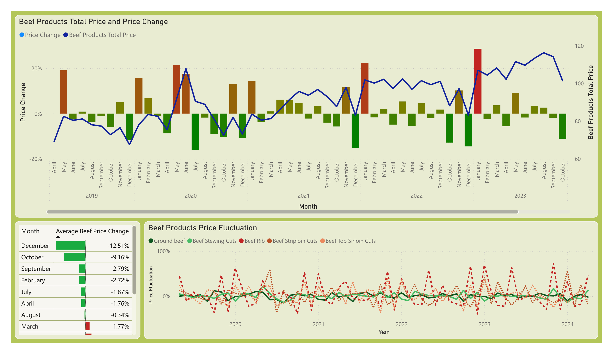

# Data & Marketing Analyst Portfolio Guide

Welcome to my Data & Marketing Analysis Portfolio.

---

## Projects Overview

| # | Project | Business Focus | Tools / Skills | Outcome |
| --- | --- | --- | --- | --- |
| 1 | **[PortfolioAI](https://github.com/StevenShi998/PortfolioAI)** | ML-driven stock allocation and plain-English recommendations for end users. | Python, Variational LSTM, PostgreSQL, full-stack dashboard | Backtested allocations, recommendation history, user preference–driven outputs. |
| 2 | **[Custom CPI & Grocery Budget](https://github.com/StevenShi998/Custom-CPI-Study)** | Why CPI increased over the last 5 years? What are the drivers and why? | SQL (CTEs, window functions), Python (pandas, NumPy), Power BI | 60-month trend, increase/decrease breakdown, beef category focus; dashboard-ready. |
| 3 | **[StageTEN](https://github.com/StevenShi998/StageTEN)** | Marketing reports and automation for HubSpot/Shopify (deal naming, app downloader, KPIs). | Python, pandas, Google Analytics, HubSpot CRM | Consistent deal naming, lifecycle segmentation, channel performance reports. |
| 4 | **[UW Course Explorer](https://github.com/StevenShi998/UW-Course-SearchTree)** | Prerequisite and future-course trees with search and ratings-weighted path recommendations. | JavaScript, SQL, graph traversal, DAG logic | Interactive tree view, optimal path selection, UW Flow–based preferences. |
| 5 | **[Alchemy E-commerce](https://github.com/StevenShi998/Alchemy-E-commerce)** | My own e-commerce store with product photography, email campaigns, and marketing content. | Adobe Photoshop, Adobe Lightroom, Shopify, email marketing | Live store, marketing campaigns, $30k+ real revenue. |
| 6 | **[FFT for Retail Cycle Detection](https://github.com/StevenShi998/Fast-Fourier-Transform)** | Dominant cycles in U.S. retail sales; smoothed series for campaign and planning use. | Python, NumPy FFT, pandas, Matplotlib, low-pass filtering | Annual cycle identification, raw vs smoothed comparison, business interpretation. |

---

## Skills at a Glance

### Programming Languages
<table>
  <tr>
    <td align="center"> <b>Python</b></td>
    <td align="center"> <b>SQL</b></td>
    <td align="center"> <b>JavaScript</b></td>
  </tr>
</table>

### Data Analysis & Visualization
<table>
  <tr>
    <td align="center"> <b>Pandas</b></td>
    <td align="center"> <b>NumPy</b></td>
    <td align="center"> <b>Matplotlib</b></td>
    <td align="center"> <b>Tableau</b></td>
    <td align="center"> <b>Power BI</b></td>
  </tr>
</table>

### Databases & Cloud
<table>
  <tr>
    <td align="center"> <b>PostgreSQL</b></td>
    <td align="center"> <b>Databricks</b></td>
  </tr>
</table>

---

## Project Details

### 1. Dynamic Portfolio Optimization (PortfolioAI)

| | |
| --- | --- |
| **Skills** | Python, Variational LSTM, PostgreSQL, FastAPI, SqlAlchemy|
| **Outcome** | Live app with user interface for preference-driven stock portfolio allocations |
| **Link** | [PortfolioAI](https://github.com/StevenShi998/PortfolioAI) |

*Recommendation dashboard with allocation output and model-backed explanation.*

End-to-end web app that turns model output into user-facing recommendations: users set risk tolerance, market cap, sectors, and indicator preferences; the app returns backtested allocations and a plain-English explanation. Demonstrates data pipeline thinking, dashboard communication, and product-oriented analytics.

---

### 2. Custom CPI & Grocery Budget Analysis

| | |
| --- | --- |
| **Skills** | SQL, Python (pandas, NumPy), Power BI |
| **Outcome** | 60-month trend, increase/decrease breakdown, interactive dashboard |
| **Link** | [Custom-CPI-Study](https://github.com/StevenShi998/Custom-CPI-Study) |

*Monthly basket trend, period-over-period price change, and ratio of increase vs decrease months.*

*Beef products: total price and price change, average monthly change, and product-level fluctuation.*

Uses Statistics Canada retail price data (2019–2024) to answer what led to the increase in grocery costs over five years.

---

### 3. StageTEN Marketing Analytics Showcase

| | |
| --- | --- |
| **Skills** | Google Analytics, Google Sheets, Python, HubSpot CRM, Canva |
| **Outcome** | PDF reports, automated deal names, lifecycle segmentation |
| **Link** | [StageTEN](https://github.com/StevenShi998/StageTEN) |

*Campaign/channel performance visual used in report-style marketing analysis.*

*T.com commerce summary: unique/total interactions and after-checkout metrics across episodes (e.g. checkout conversion, revenue).*

Built marketing reporting (e.g. Empower By U vs Shopify app downloader, TGT wrap) for large retail and SaaS company. Python automation for HubSpot/Shopify tasks: deal naming, amount/length prep, app-downloader list cleanup, duplicate detection.

---

### 4. UW Course Explorer

| | |
| --- | --- |
| **Skills** | SQL, Python, LP/MILP framing, FastAPI, SqlAlchemy |
| **Outcome** | Live site (uwtree.site), optimal path finder, depth and preference controls |
| **Link** | [UW-Course-SearchTree](https://github.com/StevenShi998/UW-Course-SearchTree) |

*Interactive graph view for prerequisite paths and future course planning.*

Built an interactive prerequisite path planner for UW students. Uses graph traversal and optimization logic to recommend efficient course sequences based on constraints, preferences, and ratings. Live at uwtree.site.

---

### 5. Alchemy E-commerce Shop

| | |
| --- | --- |
| **Skills** | Email marketing, Adobe Lightroom, Adobe Photoshop, Shopify |
| **Outcome** | Live store, email campaigns, marketing content, $30k+ real revenue |
| **Link** | [Alchemy-E-commerce](https://github.com/StevenShi998/Alchemy-E-commerce) |

*Product display and brand creative shot from the live store.*

*Store creative: product display panels and brand storytelling.*

My own e-commerce store (alchemy1916.com). Built product photography (Sony a7 IV), edited assets in Photoshop and Lightroom, and ran email campaigns and marketing posters to drive real sales—generating $30k+ in revenue.

---

### 6. FFT for Retail Cycle Detection

| | |
| --- | --- |
| **Skills** | Python, NumPy FFT, pandas, Matplotlib, PSD, inverse FFT |
| **Outcome** | Dominant cycle identification, raw vs smoothed charts, Jupyter notebook |
| **Link** | [Fast-Fourier-Transform](https://github.com/StevenShi998/Fast-Fourier-Transform) |

*Raw monthly retail sales versus smoothed trend after frequency-domain filtering.*

Applies FFT and low-pass filtering to U.S. advance retail sales (FRED RSXFSN) to isolate the annual seasonal cycle and produce a smoothed series. Shows ability to use quantitative methods (spectral analysis, filtering) and translate them into business-friendly insights for campaign timing and planning.

---
