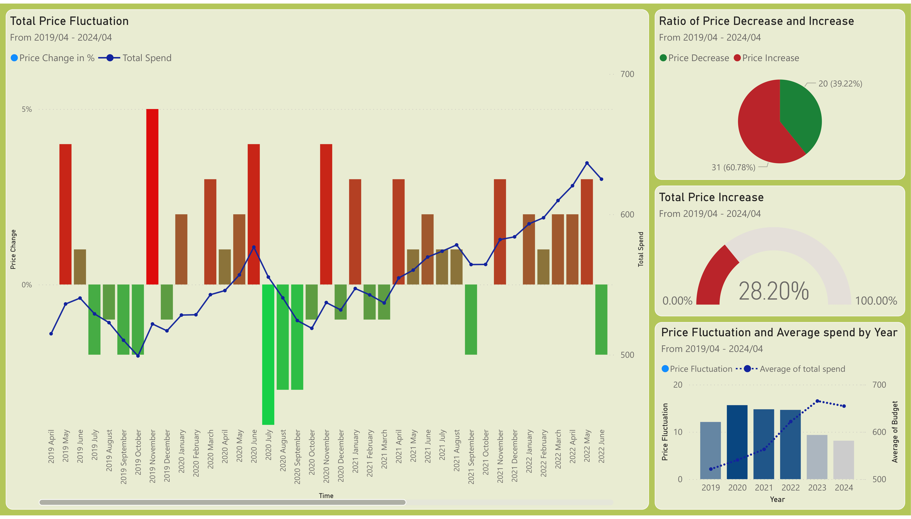
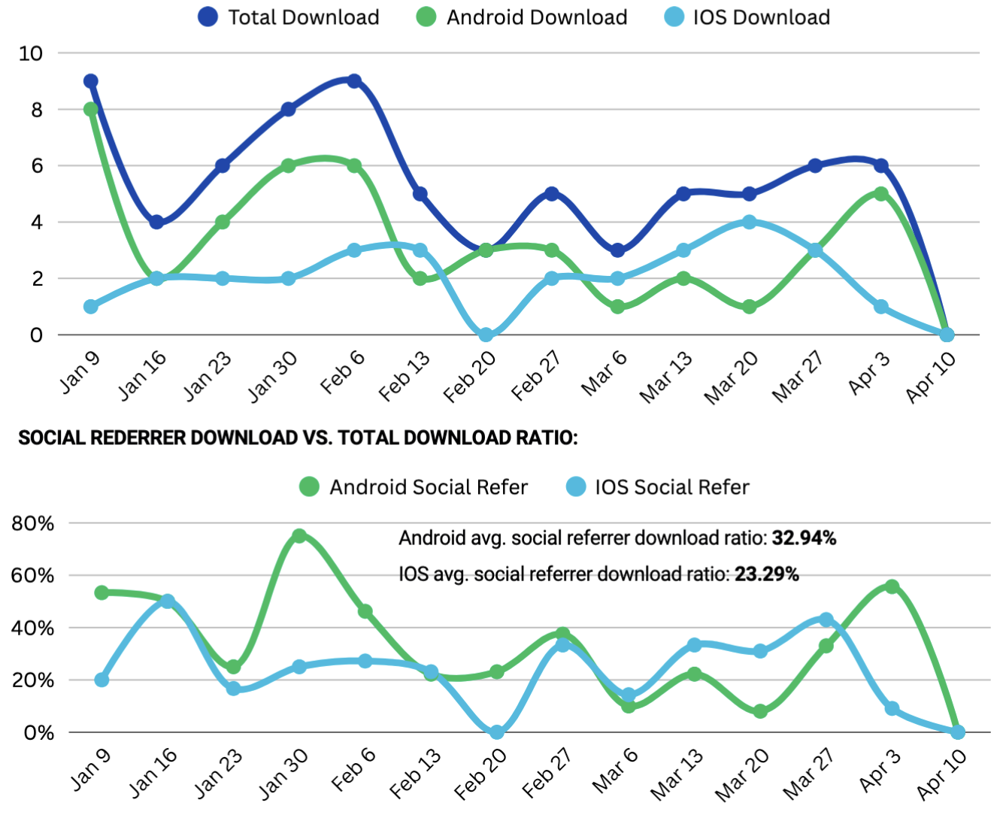
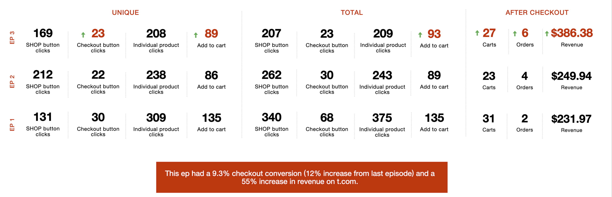
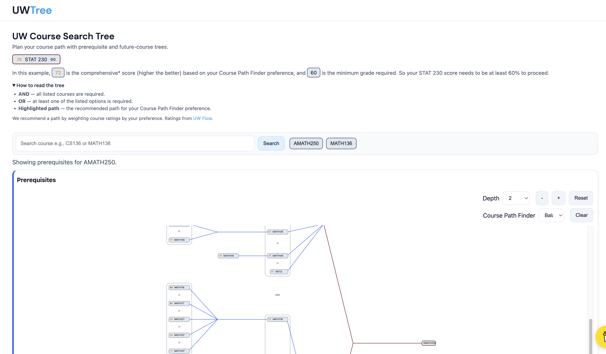
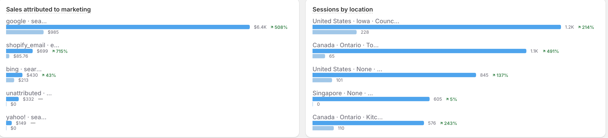
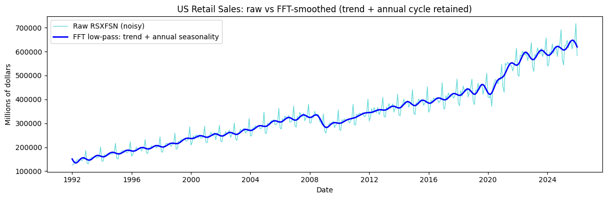

# 📊 Data & Marketing Analyst Portfolio Guide

Welcome to my Data & Marketing Analysis Portfolio. 👋

I help turn raw data into clear insights and support business decisions with SQL, Python, dashboards, and marketing analytics. This page is a curated showcase of projects across data analysis, marketing reporting, and product analytics—each with a short summary and visuals so you can quickly see what I built and which skills I used.

---

## 📋 Table of Contents

- [📊 Data \& Marketing Analyst Portfolio Guide](#-data--marketing-analyst-portfolio-guide)
  - [📋 Table of Contents](#-table-of-contents)
  - [📊 Projects overview](#-projects-overview)
  - [🛠️ Skills at a glance](#️-skills-at-a-glance)
  - [📁 Project details](#-project-details)
    - [📈 1. Dynamic Portfolio Optimization (PortfolioAI)](#-1-dynamic-portfolio-optimization-portfolioai)
    - [🛒 2. Custom CPI \& Grocery Budget Analysis](#-2-custom-cpi--grocery-budget-analysis)
    - [📢 3. StageTEN Marketing Analytics Showcase](#-3-stageten-marketing-analytics-showcase)
    - [🎓 4. UW Course Explorer](#-4-uw-course-explorer)
    - [🛍️ 5. Alchemy E-commerce Marketing Portfolio](#️-5-alchemy-e-commerce-marketing-portfolio)
    - [📉 6. FFT for Retail Cycle Detection](#-6-fft-for-retail-cycle-detection)
  - [👋 Closing](#-closing)

---

## 📊 Projects overview

| #   | Project                                                                                      | Business focus                                                                              | Tools / skills                                                  | Outcome                                                                            |
| --- | -------------------------------------------------------------------------------------------- | ------------------------------------------------------------------------------------------- | --------------------------------------------------------------- | ---------------------------------------------------------------------------------- |
| 1   | **📈 [PortfolioAI](https://github.com/StevenShi998/PortfolioAI)**                            | ML-driven stock allocation and plain-English recommendations for end users.                 | Python, Variational LSTM, PostgreSQL, full-stack dashboard      | Backtested allocations, recommendation history, user preference–driven outputs.    |
| 2   | **🛒 [Custom CPI & Grocery Budget](https://github.com/StevenShi998/Custom-CPI-Study)**       | How much did a fixed grocery basket cost over 5 years? Trend and category drivers.          | SQL (CTEs, window functions), Python (pandas, NumPy), Power BI  | 60-month trend, increase/decrease breakdown, beef category focus; dashboard-ready. |
| 3   | **📢 [StageTEN](https://github.com/StevenShi998/StageTEN)**                                  | Marketing reports and automation for HubSpot/Shopify (deal naming, app downloader, KPIs).   | Python, pandas, CSV, report writing                             | Consistent deal naming, lifecycle segmentation, channel performance reports.       |
| 4   | **🎓 [UW Course Explorer](https://github.com/StevenShi998/UW-Course-SearchTree)**             | Prerequisite and future-course trees with search and ratings-weighted path recommendations. | JavaScript, SQL/data, graph traversal, DAG logic                | Interactive tree view, optimal path selection, UW Flow–based preferences.          |
| 5   | **🛍️ [Alchemy E-commerce](https://github.com/StevenShi998/Alchemy-E-commerce)**              | My E-commerce store with content creation and Email Marketing.                              | Product photography, Photoshop, session stats, campaign content | Brand storefront, email campaigns, metrics tied to creative direction.             |
| 6   | **📉 [FFT for Retail Cycle Detection](https://github.com/StevenShi998/Fast-Fourier-Transform)** | Dominant cycles in U.S. retail sales; smoothed series for campaign and planning use.        | Python, NumPy FFT, pandas, Matplotlib, low-pass filtering       | Annual cycle identification, raw vs smoothed comparison, business interpretation.  |

---

## 🛠️ Skills at a glance

| Area                | Tools / methods                                                |
| ------------------- | -------------------------------------------------------------- |
| 🗄️ Data querying    | SQL (CTEs, window functions, aggregations), MySQL, PostgreSQL  |
| 🐍 Analysis         | Python, pandas, NumPy, descriptive analytics, time-series, FFT |
| 📊 Visualization    | Power BI, Tableau-style dashboards, Matplotlib                  |
| 📢 Marketing analytics | Campaign/channel reporting, segmentation, KPI tracking       |
| ⚙️ Workflow         | Jupyter, VS Code/Cursor, reproducible READMEs                  |

---

## 📁 Project details

Below is a short detail section for each project: visual, caption, and a compact **Skills · Outcome · Link** line so recruiters can scan quickly.

---

### 📈 1. Dynamic Portfolio Optimization (PortfolioAI)

|             |                                                                        |
| ----------- | ---------------------------------------------------------------------- |
| **Skills**  | Python, Variational LSTM, PostgreSQL, full-stack dashboard             |
| **Outcome** | Live app with recommendation history and preference-driven allocations |
| **Link**    | [PortfolioAI](https://github.com/StevenShi998/PortfolioAI)             |

 
*Recommendation dashboard with allocation output and model-backed explanation.*

End-to-end web app that turns model output into user-facing recommendations: users set risk tolerance, market cap, sectors, and indicator preferences; the app returns backtested allocations and a plain-English explanation. Demonstrates data pipeline thinking, dashboard communication, and product-oriented analytics.

---

### 🛒 2. Custom CPI & Grocery Budget Analysis

|             |                                                                      |
| ----------- | -------------------------------------------------------------------- |
| **Skills**  | SQL (CTEs, LAG, ROW_NUMBER), Python (pandas, NumPy), Power BI        |
| **Outcome** | 60-month trend, increase/decrease breakdown, interactive dashboard   |
| **Link**    | [Custom-CPI-Study](https://github.com/StevenShi998/Custom-CPI-Study) |

*Monthly basket trend, period-over-period price change, and ratio of increase vs decrease months.*

Uses Statistics Canada retail price data (2019–2024) to answer how much a fixed grocery basket changed over time. SQL handles rolling totals and percent change; Python cleans and pivots data; Power BI delivers the trend and category (e.g. beef) story. Directly relevant to data/marketing analyst roles: time-series, KPI framing, and business interpretation.

---

### 📢 3. StageTEN Marketing Analytics Showcase

|             |                                                           |
| ----------- | --------------------------------------------------------- |
| **Skills**  | Python, pandas, CSV, DictReader/DictWriter, reporting     |
| **Outcome** | PDF reports, automated deal names, lifecycle segmentation |
| **Link**    | [StageTEN](https://github.com/StevenShi998/StageTEN)      |

*Campaign/channel performance visual used in report-style marketing analysis.*

*T.com commerce summary: unique/total interactions and after-checkout metrics across episodes (e.g. checkout conversion, revenue).*

Combines marketing reporting (e.g. Empower By U vs Shopify app downloader, TGT wrap) with Python automation for HubSpot/Shopify: deal naming, amount/length prep, app-downloader list cleanup, duplicate detection. Focus on reducing manual work and delivering consistent performance insights for decision-makers.

---

### 🎓 4. UW Course Explorer

|             |                                                                              |
| ----------- | ---------------------------------------------------------------------------- |
| **Skills**  | JavaScript, SQL/data processing, graph traversal, LP/MILP framing            |
| **Outcome** | Live site (uwtree.site), optimal path finder, depth and preference controls  |
| **Link**    | [UW-Course-SearchTree](https://github.com/StevenShi998/UW-Course-SearchTree) |

*Interactive graph view for prerequisite paths and future course planning.*

Visualizes UW course prerequisite and future-course trees with search and ratings-weighted path recommendations (UW Flow). Shows structured problem-solving: DAG traversal, AND/OR logic, heuristic-guided path selection—useful for demonstrating logic design and user-centered analytics presentation.

---

### 🛍️ 5. Alchemy E-commerce Marketing Portfolio

|             |                                                                             |
| ----------- | --------------------------------------------------------------------------- |
| **Skills**  | E-commerce analytics, campaign content, session/customer metrics, Photoshop |
| **Outcome** | Live store, email campaigns, performance tracking tied to assets            |
| **Link**    | [Alchemy-E-commerce](https://github.com/StevenShi998/Alchemy-E-commerce)    |

*Session-level trend visualization used to evaluate traffic and customer activity.*

E-commerce store (alchemy1916.com) highlighting marketing abilities: content creation, product photography (Sony a7 IV), and visual editing (Photoshop). Tracks session and customer metrics to tie creative direction to measurable outcomes—relevant for marketing data analyst roles that value both creative execution and analytics.

---

### 📉 6. FFT for Retail Cycle Detection

|             |                                                                                  |
| ----------- | -------------------------------------------------------------------------------- |
| **Skills**  | Python, NumPy FFT, pandas, Matplotlib, PSD, inverse FFT                          |
| **Outcome** | Dominant cycle identification, raw vs smoothed charts, Jupyter notebook          |
| **Link**    | [Fast-Fourier-Transform](https://github.com/StevenShi998/Fast-Fourier-Transform) |

*Raw monthly retail sales versus smoothed trend after frequency-domain filtering.*

Applies FFT and low-pass filtering to U.S. advance retail sales (FRED RSXFSN) to isolate the annual seasonal cycle and produce a smoothed series. Shows ability to use quantitative methods (spectral analysis, filtering) and translate them into business-friendly insights for campaign timing and planning.

---

## 👋 Closing

For full code, datasets, and write-ups, open each project link above. This guide is designed so you can see project order, skills, and outcomes in one table and then dive into any project’s detail and visuals in a few seconds.